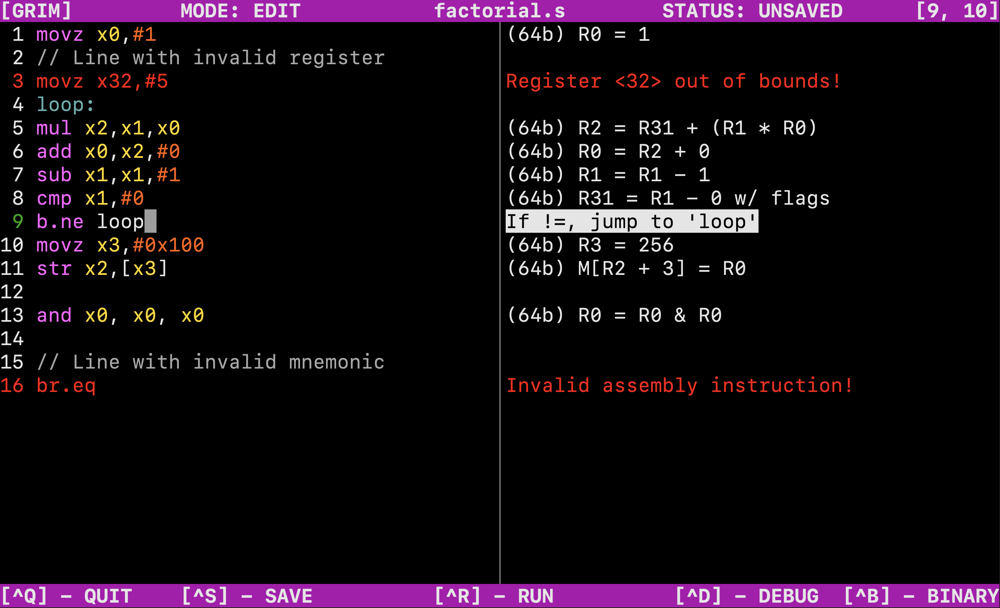

This is <b>Group 5</b>'s repository for the Arm-v8 Emulator/Assembler/Extended project.

[TOC]

# Core Section Quick-Start

## Emulator
1. Build the emulator:
    ```shell
    $ make emulate
    ```
2. Run the emulator:
    ```shell
    $ ./emulate <file_in> <file_out>
    ```
where
- `<file_in>` is the binary file to emulate
- `<file_out>` (optional) is the output file. If not specified, output will be printed to`stdout`

<details>
<summary>Emulator Example</summary>

```shell
$ ./emulate add01.bin add01.out
```
</details>

## Assembler
1. Build the assembler:
    ```shell
    $ make assemble
    ```
2. Run the assembler:
    ```shell
    $ ./assemble <file_in> <file_out>
    ```
where
- `<file_in>` is the AArch64 source file to assemble
- `<file_out>` is the output AArch64 binary code file

<details>
<summary>Assembler Example</summary>

```shell
$ ./assemble add01.s add01.bin
```
</details>

## Blinking the RPi
1. Compile the assembler:
    ```shell
    $ make assemble
    ```
2. Assemble `led_blink.s`:
    ```shell
    $ ./assemble ./programs/led_blink.s kernel8.img
    ```

# GRIM
GRIM is an IDE for a subset of the A64 instruction set. Build GRIM with this command:
```
$ make editor
```

## Running GRIM
Run GRIM with this command:
```
$ ./editor <filename>
```
where `filename` is a path to a `.s` file to open (optional).

## The Interface
There are 2 menu bars. The top bar displays the mode, the file name, the file status, and the cursor position. The bottom bar displays keyboard shortcuts.


In this example image, the mode is "edit", the file name is "loop01.s", the file status is "saved", and the cursor position is [3, 13].

### The Editor Window
The left-half of the content is used for the editor view. It contains the A64 code with syntax highlighting. The line number of the line which the cursor is currently on is displayed in green. Lines with errors are displayed in red.

## Modes
### Edit Mode
Edit mode is the default editing mode in GRIM.

The right-half of the content will display error messages on lines containing errors, and natural language explanations of lines with no errors. The line the cursor is currently on will also be highlighted. In this mode, code can be edited in the editor window and the right-hand window will live-update.



### Binary Mode
Binary mode is used to show the binary code which lines compile to. Binary mode can be toggled with <kbd>Ctrl+B</kbd>.

The right-half of the content will display error messages on lines containing errors, and the binary translation of lines with no errors. The line the cursor is currently on will also be highlighted. In this mode, code can be edited in the editor window and the right-hand window will live-update.


### Debug Mode
Debug mode is used for step-by-step execution of the assembly code. Debug mode can be toggled with <kbd>Ctrl+D</kbd>.

The editor window is not editable in debug mode. The line which is about to be executed will be highlighted in the editor window. The right-half of the content will display the contents of all the registers at the current point in execution. Press <kbd>Enter</kbd> to execute the line which is highlighted in the editor window. The right-half of the content will display the registers which were modified by the previously executed instruction in green. If a fatal runtime error is encountered, the error will be displayed.


## Running
The entire code can be run in one go with <kbd>Ctrl+R</kbd>. The right-half of the content will display the registers and their states after the code execution in a similar way to debug mode.


## Saving
A file can be saved with <kbd>Ctrl+S</kbd>. If the file does not yet exist on the computer, a dialog will appear prompting you to enter a file name. Exiting GRIM with <kbd>Ctrl+Q</kbd> will save the file before exiting.

# Generating the Reports

1. You may need to install `pygmentize`:
    ```shell
    $ pip install Pygments
    ```
2. Make the documents
    ```shell
    $ make report
    $ make clean
    ```

# Help
Use the following command to see all available `make` commands:
```shell
$ make help
```
